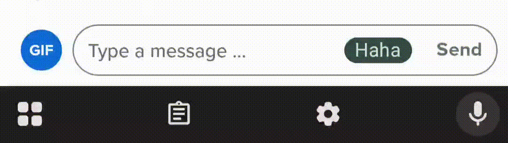
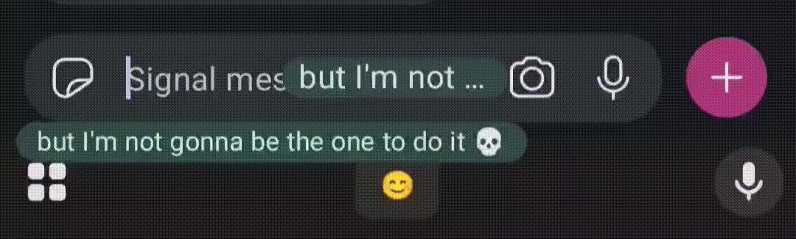

**Coreply** is an open-source Android app providing texting suggestions while you type. It enhances your typing experience with intelligent, context-aware suggestions.

## Supported Texting Apps

|                                                           |
| --------------------------------------------------------- |
| **WhatsApp**                                              |
|       |
| **Instagram**                                             |
|          |
| **Tinder**                                                |
|         |
| **Signal**                                                |
|         |
| **Notification Replies**1,2                    |
|  |
| **Hinge**                                                 |
| **LINE**                                                  |
| **Heymandi**                                              |
| **Gmail**3                                     |
| **Telegram**4                                  |
| **Mattermost**2                                |
| **Facebook Messenger**1                        |
| **Google Messages**1                           |
| **Snapchat**2                                  |
| **Microsoft Teams**                                       |
| **Viber**                                                 |

1 Performance issues: Coreply may not follow smoothly the animations and transitions.  
2 Limited role detection: Coreply cannot detect whether the message is sent or received.  
3 In Gmail, Coreply only works on the quick reply text field at the bottom of the email.
4 Including Direct Download version, Play Store version, and Nekogram.

_DISCLAIMER: Coreply is not affiliated with or endorsed by the above-mentioned apps or their parent companies._

## Features

  

-   **Real-time AI Suggestions**: Get accurate, context-aware suggestions as you type.
-   **Customizable LLM Settings**: Supports any inference service having an OpenAI compatible API.
-   **No Data Collection**: All traffic goes directly to the inference API. No data passes through intermediate servers (except for the hosted version).

## Getting Started

### Prerequisites

-   **Android 11 or higher** (Android 13 or higher recommended)
-   API Key for OpenAI or an OpenAI-compatible inference API.

### Installation & Usage

1. Install the latest APK from the [releases page](https://github.com/coreply/coreply/releases)
2. Configure the app with your API key, URL and model name (see the section below).
3. Toggle on the switch and grant necessary permissions. **If you encountered the "Restricted settings" dialog, you can follow [these steps](https://support.google.com/android/answer/12623953?hl=en).**
4. Start typing in your messaging app, and see suggestions appear!
    - Single tap on the suggestion to insert one word
    - Long press to insert the entire suggestion.

### Configurations

#### OpenAI

API URL: `https://api.openai.com/v1/`

API Key: [Grab it here](https://platform.openai.com/api-keys)

Model Name: `gpt-4.1`, `gpt-4.1-mini`, `gpt-4.1-nano`, `gpt-4o`, or `gpt-4o-mini`.

_`gpt-5` family not recommended as they are reasoning models; `mini` variants are recommended for the best cost-performance ratio._

#### Google AI Studio

API URL: `https://generativelanguage.googleapis.com/v1beta/openai/`

API Key: [Grab it here](https://aistudio.google.com/apikey)

Model Name: `gemini-2.0-flash`, `gemini-2.0-flash-lite`, or `gemini-2.5-flash-lite`.

_`gemini-2.5-flash` in AI Studio reasons by default. Therefore not recommended. `gemma-3` family in AI Studio doesn't support system instructions. Thus not compatible._

#### Openrouter

API URL: `https://openrouter.ai/api/v1/`

API Key: [Grab it here](https://openrouter.ai/settings/keys)

Model Name: `google/gemini-2.5-flash`, `google/gemini-2.5-flash-lite`, `google/gemini-2.0-flash-001`, `google/gemini-2.0-flash-lite-001`, `openai/gpt-4.1-mini`, `openai/gpt-4.1`, or `openai/gpt-oss-20b`.

#### Groq

API URL: `https://api.groq.com/openai/v1/`

API Key: [Grab it here](https://console.groq.com/keys)

Model Name: `openai/gpt-oss-20b`, `llama-3.1-8b-instant`, or `llama-3.3-70b-versatile`.

#### Others

Theoretically any OpenAI-compatible endpoint can be used. Find the API URL, API Key, and Model Name in the docs of the provider. The default system prompt works with mainstream models, but you can improve it if needed.

Personal note: I like Gemini

Note: Models listed here are just examples. You are welcome to experiment with those not listed. Although smaller models (<7B) tend to fail outputting in the desired format.

## Build From Source

1. Clone the repository:
2. Open the project in Android Studio.
3. Sync the Gradle files and resolve any dependencies.
4. Build and run the app on your preferred device or emulator.

## Model Selection

See [Model Selection & Providers](./docs/models.md) for details.

## How does it work?

See [Model Selection & Providers](./docs/models.md) for details.

## Contributing

All contributions are welcome! However, the code was based on an old project in 2016, so please be patient with the code quality and expect major architectural changes in the future.

## Known Issues

-   The app cannot read images, videos, voice notes, or other non-text content. Contextual suggestions may be limited in these cases.
-   Hint text 'Message' in WhatsApp is treated as typed text on devices running Android 12 or lower.
-   RTL support is limited.
-   Banking apps in asia commonly block apps from unknown sources having accessibility services permission due to security reasons. If you are facing this issue, you can setup [an accessibility shortcut](https://support.google.com/accessibility/android/answer/7650693?hl=en#step_1) to toggle the coreply on/off quickly. In the future there might be a Play Store listing to avoid this issue.

## Star History

## License Notice

Coreply

Copyright (C) 2024 Coreply

This program is free software: you can redistribute it and/or modify
it under the terms of the GNU Affero General Public License as published by
the Free Software Foundation, either version 3 of the License, or
(at your option) any later version.

This program is distributed in the hope that it will be useful,
but WITHOUT ANY WARRANTY; without even the implied warranty of
MERCHANTABILITY or FITNESS FOR A PARTICULAR PURPOSE. See the
GNU Affero General Public License for more details.

You should have received a copy of the GNU Affero General Public License
along with this program. If not, see <http://www.gnu.org/licenses/>.
